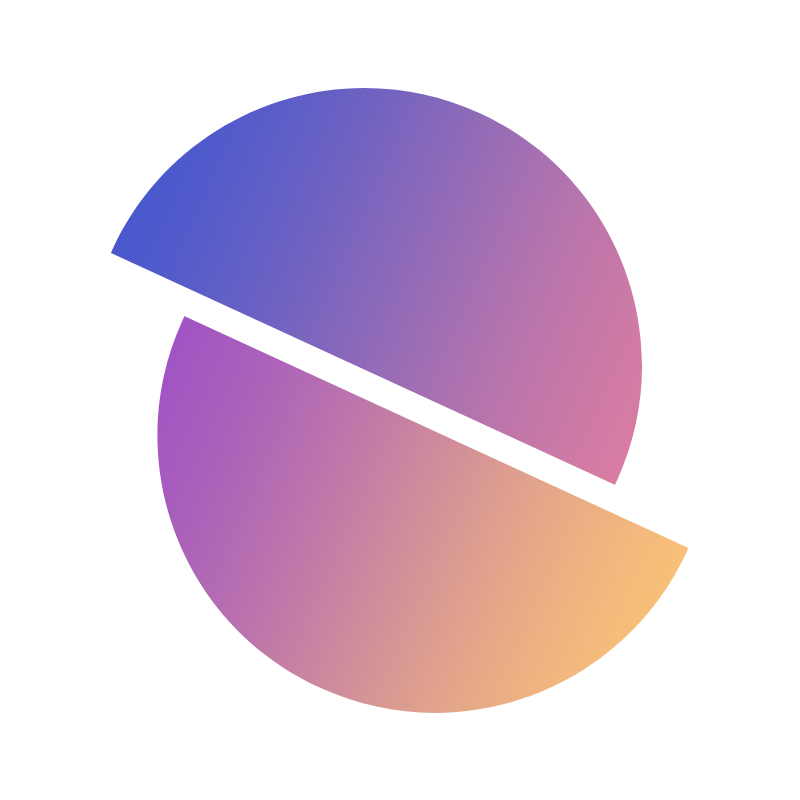

## zer0ken/branding

개인 디자인 작업물을 백업하기 위한 리포지토리입니다.

<table>
    <!-- 1행 -->
    <tr>
        <th><a href="./logo2025/"><code>logo2025</code></a></th>
        <th><a href="./colors/"><code>colors</code></a></th>
        <th><a href="./tetris-ie/"><code>tetris-ie</code></a></th>
        <th><a href="./act2025/"><code>act2025</code></a></th>
        <th><a href="./8ollow-me/"><code>8ollow-me</code></a></th>
    </tr>
    <tr>
        <td align=center></td>
        <td align=center>
            <a href="./colors/">
                
                 
                
                 
                
            </a>
        </td>
        <td align=center></td>
        <td align=center></td>
        <td align=center></td>
    </tr>
    <!-- 1행 -->
    <tr>
        <th><a href="./hire-me-asap/"><code>hire-me-asap</code></a></th>
        <th><a href="./programmers/"><code>programmers</code></a></th>
    </tr>
    <tr>
        <td align=center></td>
        <td align=center>
            
             
            
             
            
        </td>
    </tr>
</table>
