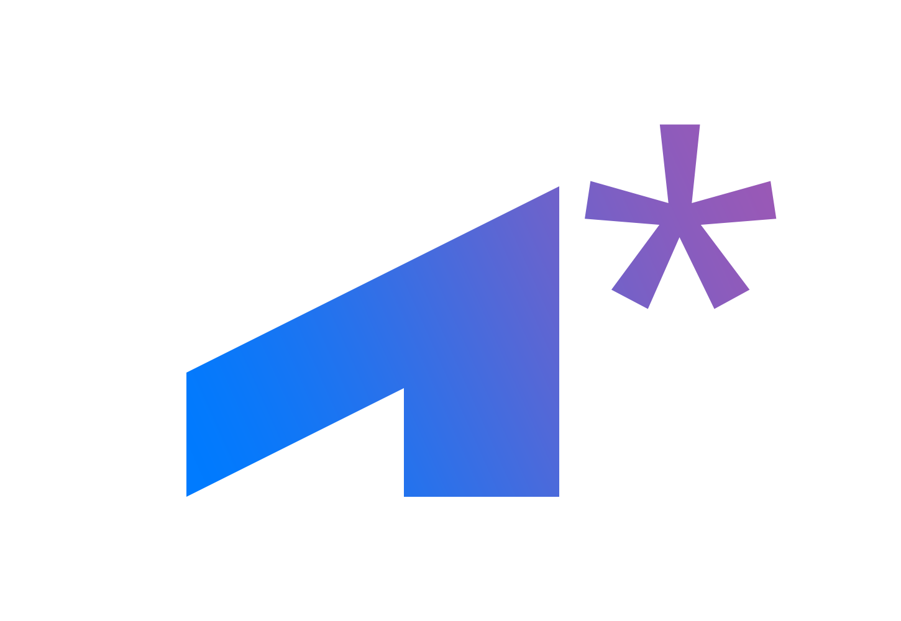
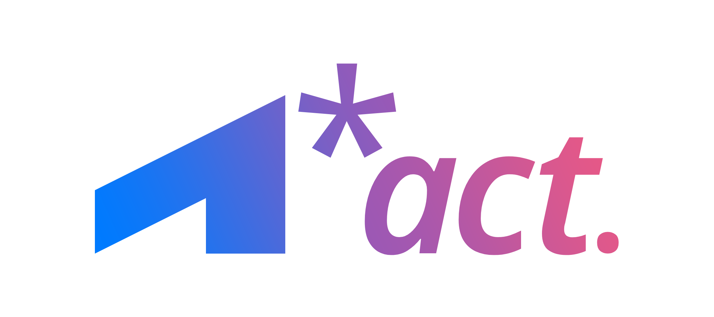
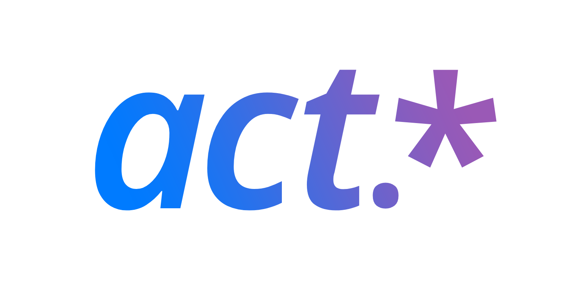
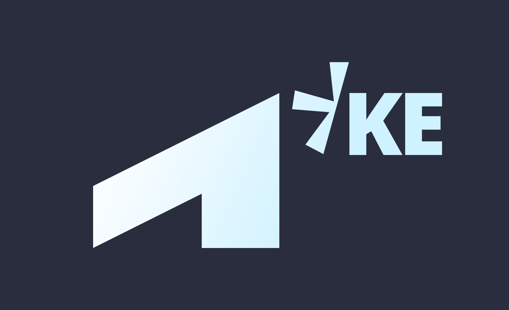
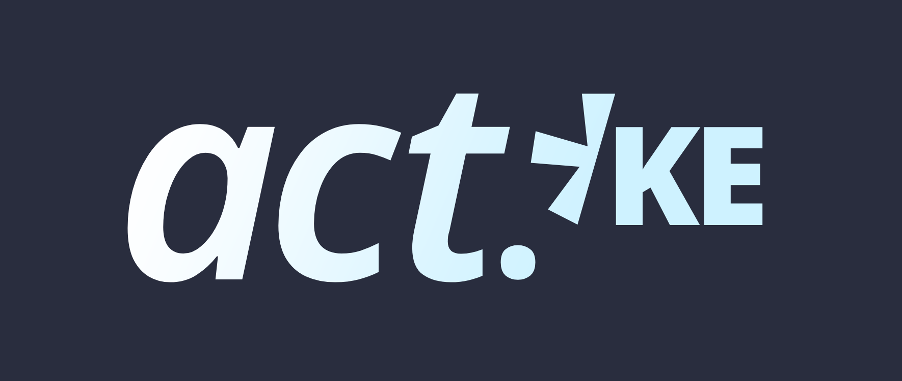

# A.C.T 2025 CI 디자인 활용 가이드

이 문서는 대전대신고등학교 개발자 동아리 A.C.T의 새로운 CI 디자인을 소개하고 사용 가이드를 제공하기 위해 작성되었습니다.

<table>
    <tr>
        <td></td>
        <td></td>
        <td></td>
    </tr>
</table>

## 1. 심볼 디자인

**A.C.T의 심볼**은 동아리 이름 첫 글자 `A`와 와일드카드 문자(애스터리스크) `*`를 활용해 디자인했습니다.
개발자로서의 기반을 다지는 것이 동아리의 주된 활동 내용이므로, 다음의 키워드에 초점을 맞췄습니다.
- `A`:
  - 견고한
  - 예리한
  - 상승하는
- `*`: 무엇이든 될 수 있는

### ❌ 종횡비
심볼을 사용할 때에는 종횡비를 변경하지 마세요.

### ✅ 여백
심볼을 사용할 때에는 반드시 적절한 여백을 포함하세요. 아래의 이미지는 권장되는 최소한의 여백 폭을 설명합니다. 각 수치는 심볼의 높이가 6이라고 가정했을 때의 상대적인 크기임을 참고하세요.

<table>
    <tr>
        <td></td>
        <td></td>
    </tr>
</table>

## 2. 로고타입 디자인

**A.C.T의 로고타입**은 동아리의 이름을 명확히 나타내기 위해 디자인되었으며, 로고에서 사용했던 애스터리스크 `*`를 그대로 계승하고 있습니다. 로고타입에서는 다음의 키워드에 초점을 맞췄습니다.
- `act`: 동아리의 이름을 한 단어로 인식시키기 위해 소문자 사용
- `.`: 동아리 이름에 포함된 점 `.`을 최소한으로 포함시킴
  - 그거 아세요? 동아리 이름의 점은 언제나 존재했지만 왜 존재하는지 정확하게 아는 사람은 거의 없습니다.
- `*`: 로고에서 사용한 애스터리스크를 그대로 계승함

동아리의 실제 이름이 **A.C.T**이지만, 로고타입에서는 소문자 `act`로 적고 있음에 유의하세요. 이는 최근 트렌드를 반영한 것으로, 대문자로 적힌 로고타입 브랜딩보다 소문자로 적힌 것이 보는 이로 하여금 쉽게 기억된다는 점에서 착안했습니다.

`act.*`는 파일 시스템으로 비유하자면 형태(확장자)가 무엇이든 상관 없이 **A.C.T**라는 이름으로 한 곳에 모일 수 있다는 의미를 함유합니다. 뿐만 아니라, 정규표현식처럼 받아들일 때에는 **A.C.T**로부터 시작되어 그 뒤에 어떤 경험(문자)이든지 올 수 있다는, 무궁한 가능성을 가지는 의미로도 볼 수 있습니다.

### ❌ 폰트와 스타일
지정된 폰트 이외의 것으로 만든 로고타입을 사용하지 마세요. 지정된 스타일을 다른 스타일로 바꾸거나, 새로운 스타일을 추가하거나, 기존 스타일을 제거하지 마세요.

### ❌ 종횡비
로고타입을 사용할 때에는 종횡비를 변경하지 마세요.

### ✅ 여백
로고타입을 사용할 때에는 반드시 적절한 여백을 포함하세요. 아래의 이미지는 권장되는 최소한의 여백 폭을 설명합니다. 각 수치는 로고타입의 x-height가 3이라고 가정했을 때의 상대적인 크기임을 참고하세요.

<table>
    <tr>
        <td></td>
        <td></td>
    </tr>
</table>

## 3. 로고 디자인

**A.C.T의 로고**는 심볼과 로고타입을 가로로 배치한 것입니다. 심볼과 로고타입 모두 애스터리스크를 포함하기 때문에, 심볼 옆에 있는 것을 유지하고 로고타입 뒤의 애스터리스크는 제외시켰습니다. 

### ❌ 배치
심볼과 로고타입을 세로로 배치하지 마세요.

### ❌ 폰트와 스타일
지정된 폰트 이외의 것으로 만든 로고를 사용하지 마세요. 지정된 스타일을 다른 스타일로 바꾸거나, 새로운 스타일을 추가하거나, 기존 스타일을 제거하지 마세요.

### ❌ 종횡비
로고를 사용할 때에는 종횡비를 변경하지 마세요.

### ✅ 여백
로고를 사용할 때에는 반드시 적절한 여백을 포함하세요. 아래의 이미지는 권장되는 최소한의 여백 폭을 설명합니다. 각 수치는 로고의 높이가 6이라고 가정했을 때의 상대적인 크기임을 참고하세요.

<table>
    <tr>
        <td></td>
        <td></td>
    </tr>
</table>

## 4. 파생된 CI 디자인

A.C.T의 특정 프로젝트나 팀을 대표하기 위해 새로운 CI 디자인이 필요하다면, 다음에 유의하여 심볼 또는 로고타입을 변형하여 사용할 수 있습니다.
- 심볼 혹은 로고타입에 포함된 애스터리스크를 사선으로 자르고, 그 옆에 협업 대상의 정보를 최소한으로 표시하는 CI 디자인을 추가하세요.
- 협업 대상의 CI 디자인을 추가할 때에는 아래 가이드에서 설명하는 크기와 위치를 참고하세요.

<table>
    <tr>
        <td></td>
        <td></td>
    </tr>
</table>

이렇게 기존 디자인으로부터 **파생된 CI 디자인**은 다음의 경우에 유용하게 사용할 수 있습니다.
- 다른 조직과의 협업에서 외부 구성원을 포용하는 팀이 결성된 경우
- 동아리 내에서 대형 혹은 장기 프로젝트를 진행하는 새로운 팀을 결성한 경우
- 동아리 내에서 고정된 역할을 수행하는 하위 부서를 대표하는 CI 디자인이 필요한 경우

### ❌ 종횡비
협업 CI 디자인을 만들 때 기존 심볼 혹은 로고타입의 종횡비를 변경하지 마세요.

### ✅ 여백
기존 심볼 혹은 로고타입의 여백 가이드를 참고하되, 추가된 디자인 요소를 적절히 고려하도록 여백을 포함하세요.

### 예시
아래는 한국에너지공과대학교(KENTECH)와의 협업에서 사용할 것을 고려하여 디자인한 협업 심볼과 로고타입입니다.

<table>
    <tr>
        <td></td>
        <td></td>
    </tr>
</table>

## 5. 색상 시스템

이 CI 디자인에는 체계적인 **색상 시스템**이 포함되어있지 않습니다. 디자인 샘플을 만들기 위해 임의로 선택해 사용한 색은 다음과 같습니다.

- 고유한 색상
  - `act-blue`: `#007BFF`
  - `act-purple`: `#9B59B6`
  - `act-coral`: `#EA5885`
  - `act-kentech-blue`: `#2D558B`
  - `act-kentech-ice`: `#CEF2FF`
- 일반적인 색상
  - `black`: `#000000`
  - `white`: `#FFFFFF`
- 디자이너의 시그니처 색상
  - `zer0ken-midnight`: `#292D3E`

CI 디자인을 사용할 때는 상황에 맞게 적절한 색을 직접 적용하세요.

### ❌ 복잡하거나 모호한 색상
- 과하게 많은 색을 조합해 사용하지 마세요. 그라데이션이라면 연속적인 색상을 2~3개, 아니라면 단색을 사용할 것을 권장합니다.
- 배경 색과 유사한 색을 사용하지 마세요. 배경색과 확실히 구분되는 색을 사용할 것을 권장합니다.

## 6. 폰트와 스타일

CI 디자인에 사용된 **폰트와 스타일**은 다음과 같습니다.
- Noto Sans Regular
- Noto Sans SemiBold
- Noto Sans SemiBold Italic

---
Copyright 2025, zer0ken & A.C.T. All rights reserved.
